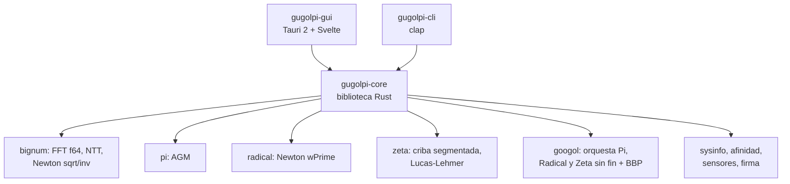

# GugolPi — Especificación

Spec v1.0 · 24 de septiembre de 2026 · Estado: aprobada para arrancar la versión 1.0. Documento vivo: https://claude.ai/code/artifact/09116826-732d-4309-b536-3e9595a46ba3

## 1. Visión y objetivos

GugolPi es un benchmark de CPU multiplataforma con tres módulos: Pi (reimplementa SuperPi), Radical (reimplementa wPrime) y Zeta (números primos, propio). Los tres tienen modo single-core y multicore, se automatizan en suites, y un cuarto modo, Gúgol, ejecuta cualquiera de las tres cargas como stress test abierto con verificación continua.

**Para quién**: overclockers y entusiastas que quieren cifras comparables entre máquinas y con el histórico de SuperPi 1M / wPrime 32M; revisores de hardware que necesitan runs repetibles y exportables; usuarios que quieren un stress test de CPU con verificación matemática del resultado.

**Objetivos medibles**

- Un run de Pi 1M en GugolPi devuelve exactamente los mismos dígitos que la referencia y un tiempo que correlaciona con el SuperPi original (misma ordenación entre CPUs).
- Un run de Radical 32M/1024M termina con verificación n² = k en el 100 % de los valores.
- Un run de Zeta 1G devuelve exactamente π(10^9) = 50 847 534 primos y un checksum idéntico a la referencia.
- Cualquier test se puede lanzar desde CLI sin interfaz, con salida JSON/CSV y código de salida, en Windows, macOS y Linux, x86-64 y ARM64.
- La GUI muestra tiempos por iteración en vivo, ficha del sistema y comparación con runs anteriores.

**Qué NO es**

- No es un clon binario: SuperPi y wPrime son cerrados (x87 y Win32); replicamos algoritmo, tamaños y estructura de iteraciones, no el ejecutable. Los tiempos absolutos serán distintos; la comparabilidad se garantiza dentro de GugolPi y por correlación con los originales.
- No es un test de estabilidad certificado tipo Prime95; el modo Gúgol detecta errores de cálculo, pero no sustituye a un test de memoria.
- Un gúgol (10^100) no es alcanzable: el modo Gúgol es abierto e indefinido, con el gúgol como meta simbólica y contador de progreso acumulado.

## 2. Los originales y qué hay que replicar

Para que los resultados sean comparables hay que replicar tres cosas de cada original: el algoritmo, los tamaños de test y la forma de medir e informar el tiempo. Lo que sigue es lo que se conoce públicamente de ambos programas (no hay código fuente publicado; las descripciones son las de sus autores y la comunidad, aproximadas).

| | SuperPi (Kanada Lab, 1995; mod 1.5 XS) | wPrime (v1.55 / 2.x) |
| --- | --- | --- |
| Qué calcula | Dígitos decimales de Pi | Raíces cuadradas de 1..N y su verificación |
| Algoritmo | Gauss–Legendre (AGM) con multiplicación por FFT en coma flotante | Newton–Raphson recursivo sobre f(x) = x² − k, arranque en k/2 |
| Tamaños | 16K, 32K, 64K, 128K, 256K, 512K, 1M, 2M, 4M, 8M, 16M, 32M dígitos (potencias de 2 × 1024) | 32M (1..32 000 000) y 1024M (1..1 024 000 000) |
| Hilos | 1 (single-thread puro, x87) | N configurable, por defecto = núcleos lógicos |
| Salida | Tiempo por iteración (loop) + total; fichero de resultado con checksum (mod 1.5 XS) | Tiempo total; verificación n² = k |
| Test de referencia | 1M (velocidad), 32M (estabilidad) | 32M (rápido), 1024M (largo) |
| Plataforma | Windows 32 bits; Linux/macOS vía Wine | Windows |

**Aviso sobre wPrime**: pese al nombre, wPrime no calcula números primos. El nombre es un guiño a Prime95. Su carga real es raíces cuadradas por Newton, y eso es lo que replica el módulo Radical. Los primos tienen su propio módulo, Zeta (sección 5), y su carga en el modo Gúgol (sección 6).

**Qué replicamos exactamente**

- Mismo algoritmo y misma estructura de iteraciones, para que el perfil de carga (FFT grande, memoria, FPU) sea equivalente.
- Mismos tamaños nominales, con los mismos nombres (Pi 1M, Radical 32M) para que la gente los reconozca.
- Mismo esquema de informe: Pi da tiempo por loop y total; Radical da tiempo total.
- Verificación de resultado como en mod 1.5 XS: fichero de resultado con hash de integridad (firma criptográfica en 1.3).

**Qué no podemos replicar y cómo lo tratamos**

- Precisión x87 de 80 bits: usamos double (64 bits) o enteros (NTT). Los dígitos de Pi son idénticos igualmente porque se validan contra referencia; sólo cambia el tiempo.
- FFT propia de Kanada en Fortran/ASM: implementamos nuestra propia FFT; los tiempos absolutos difieren. Publicamos una tabla de correlación (GugolPi vs. SuperPi original en las mismas CPUs) para que se pueda traducir.
- Formato exacto del checksum de mod 1.5 XS: no es público; definimos el nuestro (sección 10).

**Modo Legacy** (pospuesto a 1.3): detectar los binarios originales si el usuario los tiene y lanzarlos desde GugolPi (Windows nativo; Wine en el resto) para obtener la cifra clásica junto a la nuestra.

## 3. Módulo Pi (SuperPi)

El módulo Pi calcula 2^k × 1024 dígitos decimales de Pi con el algoritmo de Gauss–Legendre (AGM), igual que SuperPi, e informa el tiempo de cada iteración y el total. Su comportamiento por defecto es idéntico al de SuperPi: un solo hilo, tamaños clásicos, informe por loop.

**Algoritmo (Gauss–Legendre)**

```latex
a_0 = 1,\quad b_0 = \tfrac{1}{\sqrt{2}},\quad t_0 = \tfrac{1}{4},\quad p_0 = 1
```

```latex
a_{n+1} = \tfrac{a_n + b_n}{2},\quad b_{n+1} = \sqrt{a_n b_n},\quad t_{n+1} = t_n - p_n (a_n - a_{n+1})^2,\quad p_{n+1} = 2 p_n
```

```latex
\pi \approx \frac{(a_{n+1} + b_{n+1})^2}{4\, t_{n+1}}
```

La convergencia es cuadrática: cada iteración dobla los dígitos correctos. Eso da 19 loops para 1M y 24 para 32M, las mismas cifras que muestra SuperPi. Cada loop es una suma, una raíz cuadrada (Newton sobre 1/√x) y un cuadrado, todo sobre números de millones de dígitos; la raíz y el cuadrado se apoyan en la multiplicación por FFT, que es donde se va el 90 % del tiempo.

**Aritmética de precisión arbitraria (propia, sin GMP)**

| Componente | Diseño | Motivo |
| --- | --- | --- |
| Representación | Punto fijo, limbs en base 10^4 (motor f64) o 2^64 (motor NTT) | Base 10^4 da decimales directos y coincide con el perfil FPU de SuperPi |
| Multiplicación | FFT compleja en f64, radix-4/split-radix, convolución en ángulo recto (right-angle) para halvar tamaño | Es lo que hacía SuperPi; carga FPU + ancho de banda de memoria |
| Control de error FFT | Comprobar que el máximo error de redondeo < 0,25 por coeficiente; si no, invalidar el run | Detecta CPUs inestables como hacía SuperPi ("not exact in round") |
| Raíz cuadrada | Newton sobre 1/√x con precisión creciente (doblando cada paso) | Estándar; coste ≈ 1,5–2 multiplicaciones |
| División final | Newton sobre 1/x, una sola vez al final | Coste despreciable frente a los loops |
| Motor alternativo | NTT sobre primos de 64 bits (exacto, entero, SIMD) | Solo para verificación cruzada y modo Gúgol; no puntuable. Post-1.0 |

**Tamaños**: 16K, 32K, 64K, 128K, 256K, 512K, 1M, 2M, 4M, 8M, 16M, 32M (K = 1024 dígitos, M = 1 048 576). Extensión GugolPi (1.3): 64M, 128M, 256M, 512M, 1G marcados como "extendidos" (no existen en SuperPi).

**Modos de ejecución**

| Modo | Qué hace | Cifra que se informa | Comparable con SuperPi |
| --- | --- | --- | --- |
| Single (por defecto) | 1 hilo, afinidad fija a un núcleo (elegible) | Tiempo total + tiempo por loop | Sí (es el modo oficial) |
| Multi: instancias (por defecto en multi) | N copias independientes del cálculo, una por hilo, arrancadas a la vez | Tiempo de la más lenta, media, y throughput (dígitos/s agregados) | Con "SuperPi ×N" que usaban los overclockers |
| Multi: FFT paralela (opción, no oficial) | Un solo cálculo, con la FFT y los bucles de limbs repartidos entre hilos | Tiempo total + escalado (speedup vs. single) | No (cifra nueva de GugolPi) |

**Salida** (igual que SuperPi, ampliada)

- Línea por loop: número de loop, tiempo del loop, tiempo acumulado.
- Resumen: tamaño, modo, hilos, tiempo total, dígitos/s, resultado de verificación (hash de dígitos vs. referencia embebida), error máximo FFT.
- Opcional: fichero con los dígitos (formato texto, 100 dígitos por línea) y el fichero de resultado (sección 10).

**Requisitos de memoria**: ≈ 12 bytes por dígito en el motor f64 (unos 400 MB para 32M). El programa comprueba la RAM libre antes de arrancar y rechaza tamaños que no caben.

## 4. Módulo Radical (wPrime)

El módulo Radical calcula la raíz cuadrada de todos los enteros de 1 a N por Newton–Raphson, verifica cada resultado y reparte el rango entre hilos, exactamente como describe el autor de wPrime. El nombre viene del signo radical (√) y de la idea de calcular raíces "a lo radical".

**Algoritmo por número k** (descripción oficial de wPrime, replicada paso a paso)

1. Arrancar en x = k / 2.
2. Iterar Newton sobre f(x) = x² − k hasta que el signo de f(x)/f'(x) cambie respecto a la iteración anterior:

```latex
x_{i+1} = x_i - \frac{x_i^2 - k}{2 x_i}
```

3. Aplicar un número fijo de iteraciones adicionales (R, por defecto 4) para afinar.
4. Verificar que x² = k dentro de la tolerancia de double (|x² − k| ≤ k · 2^−50). Si falla, contar error.

Todo en double (64 bits), sin usar la instrucción sqrt del procesador: la carga es la cadena de divisiones y multiplicaciones de Newton, que es lo que mide wPrime. El compilador no debe reemplazar el bucle por `sqrt` (se fuerza con operaciones volátiles o barreras).

**Tamaños**: 32M (N = 32 000 000) y 1024M (N = 1 024 000 000), como wPrime. Extensión GugolPi: 128M, 4096M y N libre.

**Hilos y reparto**

| Parámetro | Por defecto | Notas |
| --- | --- | --- |
| Hilos | Núcleos lógicos | Modo single = 1 hilo con afinidad |
| Reparto | Bloques de 1 M números, cola dinámica (work-stealing) | El coste por k crece con log(k); el reparto estático desequilibra |
| Reparto estático | Opción `--static` | Rango contiguo por hilo, para reproducir el comportamiento clásico |
| SMT | Opción hilos = núcleos físicos | Para comparar con y sin hyperthreading |
| Afinidad | Opcional | Fija cada hilo a un núcleo |

**Modos**

- Single: 1 hilo. Cifra de rendimiento por núcleo.
- Multi: N hilos. Cifra comparable con wPrime 32M / 1024M.
- Escalado: barrido automático de 1, 2, 4 … N hilos y curva de speedup (útil para revisiones).

**Salida**

- Tiempo total (la cifra wPrime), números/s, tiempo por hilo (min, max, media) y desequilibrio.
- Errores de verificación: número de k fallidos. Cualquier error invalida el run.
- Fichero de resultado (sección 10).

**Nota de comparabilidad**: wPrime 1.55 y 2.x no dan cifras comparables entre sí (cambiaron el código). GugolPi fija su propia versión de puntuación (`score_version`) y la sube sólo si cambia algo que afecte al tiempo.

## 5. Módulo Zeta (números primos)

Zeta es el módulo propio de GugolPi: cuenta todos los primos hasta N con una criba de Eratóstenes segmentada, verifica el recuento contra π(N) conocido y da una cifra comparable en single y multicore. El nombre viene de la función zeta de Riemann, cuyos ceros gobiernan la distribución de los primos.

Complementa a los otros dos: Pi mide FPU y ancho de banda de memoria, Radical mide latencia de división en coma flotante, Zeta mide enteros, caché L1/L2 y predicción de saltos.

**Algoritmo** (fijo; cambiarlo sube `score_version`)

1. Calcular los primos de criba hasta √N con una criba simple.
2. Recorrer [2, N] por segmentos de tamaño igual a la caché L1 de datos (32 a 64 KB), con rueda módulo 30: un byte representa 30 números (8 residuos coprimos), sin pares ni múltiplos de 3 y 5.
3. En cada segmento, marcar múltiplos de cada primo de criba a partir de su primer múltiplo en el segmento (con offset guardado entre segmentos); los primos grandes (mayores que el segmento) se tratan con cubos (bucket sieve) para no recorrer el segmento en vano.
4. Contar bits a cero con popcount; acumular π(N) y un checksum de 64 bits (suma módulo 2^64 de los primos) que se compara con la referencia embebida.

No se usa ninguna biblioteca externa de criba: el código es propio para que la carga sea estable entre versiones.

**Tamaños**

| Nombre | N | π(N) esperado | Uso |
| --- | --- | --- | --- |
| Zeta 100M | 10^8 | 5 761 455 | Rápido (< 1 s) |
| Zeta 1G | 10^9 | 50 847 534 | Cifra insignia |
| Zeta 10G | 10^10 | 455 052 511 | Largo |
| Zeta 100G | 10^11 | 4 118 054 813 | Extendido, multicore |

La memoria es mínima (primos de criba hasta √N y un búfer por hilo): Zeta 100G cabe en menos de 50 MB, por lo que es un test puro de núcleo y caché.

**Modos**

| Modo | Reparto | Cifra |
| --- | --- | --- |
| Single | 1 hilo, afinidad fija | Tiempo total, números cribados/s |
| Multi | Bloques contiguos de segmentos en cola dinámica, un búfer por hilo | Tiempo total, speedup vs. single |
| Escalado | Barrido 1, 2, 4 … N hilos | Curva de speedup |

**Verificación**: π(N) exacto y checksum idéntico a la referencia; además, cotejo intermedio en cada potencia de 10. Cualquier discrepancia invalida el run.

**Salida**: tiempo total, π(N), números/s, primos/s, tiempo por hilo (min, max, media) y fichero de resultado (sección 10).

**Carga extendida (post-1.0, no oficial)**: Zeta-LL, test de Lucas–Lehmer sobre un número de Mersenne 2^p − 1 de exponente fijo, con la FFT del módulo Pi. Sirve para medir FPU sostenida al estilo Prime95 y reutiliza el verificador de Pi; el residuo final de 64 bits se compara con el valor conocido.

## 6. Modo Gúgol (versión 1.2)

El modo Gúgol es un stress test abierto con tres cargas, una por módulo: dígitos de Pi, raíces cuadradas y números primos. Calcula sin parar, verifica cada bloque y acumula el progreso hacia un gúgol (10^100) como contador simbólico. Se detiene por tiempo, por error, por temperatura o a mano.

Un gúgol es inalcanzable: el universo observable tiene unos 10^80 átomos y el récord mundial de Pi ronda 10^14 dígitos. Por eso el modo se define como carga indefinida con verificación continua, no como un objetivo que termina. Las tres cargas pueden correr solas o combinadas (por ejemplo, Pi en la mitad de los hilos y primos en la otra mitad) para mezclar FPU, memoria y enteros.

**Gúgol Pi** (reutiliza el módulo Pi; carga FPU + memoria)

| Submodo | Qué hace | Verificación |
| --- | --- | --- |
| Escalera | Repite AGM subiendo de tamaño (1M, 2M, …) hasta el mayor que cabe en la RAM permitida, y vuelve a empezar | Hash de dígitos vs. referencia embebida |
| Cruzado | Calcula el mismo tamaño con el motor f64 y con el motor NTT en paralelo y compara | Los dos resultados deben coincidir bit a bit |
| Sonda BBP | Cada ciclo, calcula dígitos hexadecimales de Pi en posiciones aleatorias con la fórmula BBP y los coteja con el resultado | Verificación independiente y barata (O(n log n) por posición) |

Contador: dígitos de Pi calculados y verificados.

**Gúgol Radical** (reutiliza el módulo Radical; carga de latencia FP)

| Submodo | Qué hace | Verificación |
| --- | --- | --- |
| Ascendente | Newton sobre k = 1, 2, 3 … sin límite, en bloques de 1 M repartidos entre hilos | n² = k en cada valor, más cotejo de una muestra aleatoria con raíz entera exacta (isqrt) |
| Deriva | Cada 10 min recalcula el bloque 1..32M y compara el checksum de los resultados con el de la primera pasada | Detecta errores silenciosos que la tolerancia de n² = k no vería |

Contador: raíces calculadas y verificadas.

**Gúgol Primos** (reutiliza el módulo Zeta; carga de enteros y caché)

| Submodo | Qué hace | Verificación |
| --- | --- | --- |
| Criba ascendente | Criba segmentada desde 2 sin límite superior, un segmento por hilo | Cotejo de π(x) en cada potencia de 10 con la tabla conocida (hasta 10^29) y checksum por tramo |
| Mersenne | Lucas–Lehmer encadenado sobre exponentes conocidos (Zeta-LL), estilo Prime95 | Los exponentes de primos de Mersenne deben dar primo, el resto compuesto; residuo de 64 bits conocido |

Contador: primos encontrados y verificados; el contador "gúgol" muestra la fracción alcanzada (por ejemplo 3,2 × 10^-91) como guiño.

**Métricas en vivo**

- Throughput instantáneo y sostenido (dígitos/s, raíces/s, primos/s) y caída respecto al pico: una caída mantenida > 15 % se marca como posible throttling.
- Errores detectados (redondeo FFT, hash incorrecto, n² ≠ k, π(x) incorrecto) con marca de tiempo. Un error para el run y lo marca como fallido.
- Temperatura y frecuencia cuando el sistema las expone (Linux hwmon, Windows WMI, macOS sólo frecuencia). Nunca es requisito.
- Uso de memoria y tamaño actual del cálculo.

**Condiciones de parada**: duración (`--duration 1h`), primer error (`--stop-on-error`, activo por defecto), temperatura máxima si hay sensor, o parada manual. Al terminar genera el mismo fichero de resultado que los otros módulos, con el histórico de throughput por minuto.

## 7. Automatización

Todo lo que hace la GUI se puede hacer desde la CLI `gugolpi`, sin ventana, con salida JSON o CSV y código de salida, para scripts y CI.

**Comandos**

| Comando | Qué hace | Ejemplo | Versión |
| --- | --- | --- | --- |
| `pi` | Un run del módulo Pi | `gugolpi pi --size 1M` | 1.0 |
| `radical` | Un run del módulo Radical | `gugolpi radical --size 32M --threads auto` | 1.0 |
| `zeta` | Un run del módulo Zeta | `gugolpi zeta --size 1G --threads auto` | 1.0 |
| `suite` | Ejecuta una suite definida en fichero | `gugolpi suite trio --repeat 3 --out results/` | 1.0 |
| `sysinfo` | Ficha del sistema en JSON | `gugolpi sysinfo` | 1.0 |
| `compare` | Tabla comparativa de varios resultados | `gugolpi compare a.json b.json --csv` | 1.0 |
| `googol` | Modo Gúgol con una o varias cargas | `gugolpi googol pi,primes --duration 2h --max-mem 8G` | 1.2 |
| `verify` | Comprueba la firma e integridad de un fichero de resultado | `gugolpi verify run-2026-09-24.json` | 1.3 |

**Opciones comunes**: `--mode single|multi`, `--threads N|auto|physical`, `--affinity`, `--repeat N` (informa mejor, media y desviación), `--warmup`, `--json`, `--csv`, `--quiet`, `--out DIR`, `--engine f64|ntt` (sólo f64 puntuable).

**Suites** (fichero TOML). Presets incluidos:

- `classic`: Pi 1M single + Radical 32M multi (las dos cifras de siempre).
- `trio`: Pi 1M single, Radical 32M multi, Zeta 1G multi (la tarjeta de presentación de GugolPi).
- `full`: Pi 1M y 32M single; Pi 1M instancias; Radical 32M y 1024M multi; Zeta 1G single y 10G multi; barrido de escalado de los tres.
- `stability` (1.2): Pi 32M × 3 + Gúgol Pi 30 min + Gúgol Radical 30 min + Gúgol Primos 30 min.

```toml
[suite]
name = "trio"
repeat = 3

[[test]]
module = "pi"
size = "1M"
mode = "single"

[[test]]
module = "radical"
size = "32M"
threads = "auto"

[[test]]
module = "zeta"
size = "1G"
threads = "auto"
```

**Resultado**: un JSON por run (esquema en sección 10) y un `summary.csv` por suite con una fila por run. Códigos de salida: 0 correcto, 1 error de uso, 2 verificación fallida (CPU inestable), 3 recursos insuficientes.

**Integración**: plantilla de GitHub Actions y de cron/Programador de tareas para runs periódicos; modo `--watch` que reejecuta una suite cuando cambia un fichero de configuración (para pruebas de overclock iterativas); comparación automática con el run anterior en la misma máquina y aviso si la diferencia supera un umbral.

## 8. Arquitectura y stack

Decidido: Rust para todo el núcleo (aritmética, FFT, hilos), una CLI sobre ese núcleo y una GUI en Tauri 2 que llama al mismo núcleo. Un solo repositorio, un workspace de Cargo.



La GUI y la CLI son capas finas: no contienen lógica de cálculo ni de medición, sólo presentan lo que devuelve el núcleo. Así un run desde la GUI y desde la CLI dan el mismo fichero de resultado.

**Estructura del repositorio**

```
GugolPi/
  Cargo.toml              workspace
  crates/gugolpi-core/    biblioteca: bignum, pi, radical, zeta, googol, sysinfo, result
  crates/gugolpi-cli/     binario `gugolpi`
  apps/gugolpi-gui/       Tauri 2 + Svelte (1.1)
  suites/                 presets TOML
  docs/adr/               decisiones de arquitectura (ADR)
  .github/workflows/      CI: fmt, clippy, test en Linux, macOS y Windows
```

**Por qué Rust**: sin GC ni pausas que ensucien la medición, SIMD explícito (AVX2/AVX-512 en x86-64, NEON en ARM64) con `std::arch`, hilos seguros, un binario estático por plataforma y compilación cruzada con `cargo`.

**Por qué Tauri**: interfaz moderna (web) con backend Rust nativo, binarios de pocos MB, instaladores para los tres sistemas.

**Plataformas soportadas**

| SO | Arquitecturas | Formato de distribución |
| --- | --- | --- |
| Windows 10/11 | x86-64, ARM64 | MSI + zip portable |
| macOS 12+ | ARM64 (Apple Silicon), x86-64 | DMG (universal) + Homebrew |
| Linux (glibc 2.31+) | x86-64, ARM64 | AppImage, deb, tarball |

**Detalles del núcleo que afectan a la medición**

- Un único binario por plataforma con despacho de SIMD en tiempo de ejecución (detecta AVX2/AVX-512/NEON); el nivel usado se guarda en el resultado.
- Reloj monotónico de alta resolución; se mide sólo el cálculo, nunca la E/S ni la conversión de dígitos.
- Memoria reservada y tocada antes de arrancar el cronómetro (evita fallos de página en el primer loop).
- Afinidad por hilo con `core_affinity`; en macOS sólo hay pistas (QoS), y se documenta.
- Prioridad de proceso elevable con opción (`--high-priority`), nunca por defecto.

## 9. Prácticas de ingeniería

El objetivo es no tener que refactorizar: la API del núcleo se diseña completa desde el primer commit, aunque los módulos lleguen por fases.

**API del núcleo estable desde el día 1**

- Un trait `Benchmark` con `run(&self, config, progress) -> Result<RunResult, Error>`; Pi, Radical, Zeta y las cargas de Gúgol lo implementan. CLI, GUI y suites sólo hablan con ese trait.
- `RunConfig` y `RunResult` son structs serializables (serde) con `schema_version`; cualquier campo nuevo es opcional y se añade sin romper ficheros antiguos.
- El progreso se comunica por un canal tipado (`ProgressEvent`), nunca por callbacks con estado global; sirve igual para la barra de la CLI y para la GUI.
- Las constantes que afectan a la puntuación (tamaños, `score_version`, tolerancias) viven en un solo módulo `score`, documentado.

**Calidad de código**

- `rustfmt` y `clippy` con `-D warnings` y los lints `unwrap_used`, `expect_used`, `panic` y `missing_docs` activados en el núcleo: sin pánicos posibles en biblioteca; los errores son un enum con `thiserror`, y `anyhow` sólo en los binarios.
- `#![forbid(unsafe_code)]` en todo el workspace salvo el módulo `simd`, que aísla los intrínsecos tras funciones seguras y se prueba contra la versión escalar.
- Separación estricta: `bignum` no sabe qué es un benchmark; los benchmarks no saben de JSON ni de terminales; la serialización vive en `result`.
- Sin estado global ni singletons; la configuración se pasa explícita.
- Dependencias mínimas y auditadas con `cargo deny` (licencias compatibles con MIT y avisos de seguridad).

**Pruebas**

- Unitarias por módulo; propiedades (proptest) de `bignum` contra `num-bigint` como referencia en dev-dependencies.
- Tests dorados: dígitos de Pi de 16K a 32M, π(N) y checksum de Zeta, verificación completa de Radical.
- Tests de integración de la CLI con `assert_cmd` (códigos de salida, JSON válido contra el esquema).
- Benchmarks de regresión con `criterion` para FFT, criba y Newton; un cambio > 5 % exige una entrada en el changelog y, si toca la carga, subir `score_version`.

**Proceso**

- Conventional Commits, semver, changelog en formato Keep a Changelog.
- Cada decisión de diseño se registra como ADR en `docs/adr/`.
- CI obligatoria en Linux, macOS y Windows: formato, clippy, tests, `cargo deny`. No se mezcla nada en `main` con la CI en rojo.
- Rustdoc en todos los elementos públicos; el README explica cómo correr los tres tests en un minuto.

## 10. Validez y comparabilidad de resultados

Un resultado es válido si el cálculo verifica, el fichero está íntegro y el run se hizo con parámetros oficiales; sólo los runs válidos con el mismo `score_version` son comparables entre sí.

**Verificación matemática**

- Pi: SHA-256 de los dígitos comparado con una tabla embebida por tamaño (16K a 32M en 1.0), generada una vez con y-cruncher y comprobada contra los dígitos publicados. Además, error máximo de redondeo de la FFT en cada multiplicación.
- Radical: verificación n² = k en cada valor; cero errores admitidos.
- Zeta: π(N) exacto y checksum de 64 bits idéntico a la referencia embebida; cotejo intermedio en cada potencia de 10.
- Gúgol: cotejos de la sección 6.

**Fichero de resultado** (JSON, uno por run)

| Campo | Contenido |
| --- | --- |
| `schema_version` | Versión del esquema del fichero |
| `tool` | Nombre, versión, `score_version`, commit, nivel SIMD usado |
| `system` | CPU (modelo, núcleos físicos/lógicos, frecuencia base y observada), RAM, SO y versión, hipervisor si se detecta |
| `test` | Módulo, tamaño, modo, hilos, afinidad, motor, opciones no por defecto |
| `timing` | Inicio (UTC), tiempo total, tiempo por loop (Pi) o por hilo (Radical, Zeta), throughput |
| `verification` | Estado, hash de dígitos o checksum, error FFT máximo, errores contados |
| `official` | `true` sólo si motor f64, sin opciones que alteren la carga y verificación correcta |
| `integrity` | SHA-256 del JSON canónico (1.0); firma Ed25519 con clave embebida (1.3) |

**Firma** (1.3): como en SuperPi mod 1.5 XS, la firma sirve para detectar ficheros editados a mano, no contra un atacante que recompile el programa. La clave privada va embebida y ofuscada; `gugolpi verify` comprueba la firma y avisa si la versión del binario está en la lista de builds no oficiales.

**Reglas de comparabilidad**

1. Mismo `score_version`. Se incrementa cuando cambia la FFT, el orden de operaciones, los tamaños o cualquier cosa que mueva los tiempos.
2. Mismo test, tamaño y modo. "Pi 1M single" es la cifra insignia; "Radical 32M multi" y "Zeta 1G multi" la acompañan.
3. Runs con `official = false` (motor NTT, tamaños extendidos, opciones experimentales) se muestran, pero no entran en rankings ni en `compare` sin `--include-unofficial`.
4. Con `--repeat`, la cifra que se compara es la mejor de las repeticiones (convención de SuperPi), y se informan media y desviación.

**Correlación con los originales** (1.3): publicamos una tabla GugolPi vs. SuperPi 1M y vs. wPrime 32M/1024M en al menos 10 CPUs (Intel, AMD, Apple Silicon vía Wine para SuperPi) para que el usuario pueda situar su cifra frente al histórico.

## 11. Roadmap y decisiones

La 1.0 es el núcleo más la CLI: suficiente para probar la herramienta y comparar cifras. GUI, Gúgol y firma llegan en versiones menores sin cambiar la API del núcleo.

| Versión | Contenido | Criterio de salida |
| --- | --- | --- |
| 1.0 | `gugolpi-core` (bignum, Pi, Radical, Zeta, single y multi), CLI (`pi`, `radical`, `zeta`, `suite`, `sysinfo`, `compare`), JSON/CSV, verificación, CI en tres SO, licencia MIT | Dígitos correctos de 16K a 32M; Radical 32M/1024M y Zeta 1G/10G verifican; Pi 1M por debajo de 10 s en un portátil actual; suite `trio` corre en GitHub Actions |
| 1.1 | GUI Tauri 2: lanzar tests, loops en vivo, ficha del sistema, histórico local | Un run desde GUI y desde CLI producen el mismo fichero |
| 1.2 | Modo Gúgol con las tres cargas, sensores, preset `stability` | 2 h de Gúgol combinado sin falsos positivos en una máquina estable |
| 1.3 | Firma Ed25519 y `verify`, tabla de correlación con los originales, tamaños extendidos, motor NTT, Zeta-LL, modo Legacy | Release con instaladores para las tres plataformas |

**Hitos internos de la 1.0**

1. Esqueleto del workspace, CI, ADR iniciales, API del núcleo (`Benchmark`, `RunConfig`, `RunResult`), `sysinfo`.
2. `bignum`: FFT f64, multiplicación, raíz e inverso por Newton, tests de propiedades.
3. Pi: AGM, tamaños 16K–32M, referencias embebidas, informe por loop, modo instancias.
4. Radical: Newton, reparto dinámico, verificación, single/multi/escalado.
5. Zeta: criba segmentada con rueda 30 y bucket sieve, referencias, single/multi/escalado.
6. CLI completa: suites TOML, presets, JSON/CSV, `compare`, códigos de salida. Release 1.0.

**Decisiones tomadas**

- [x] Módulo de primos: Zeta.
- [x] Módulo wPrime: Radical.
- [x] GUI: Tauri 2 (en 1.1).
- [x] Pi por defecto: idéntico a SuperPi (single, un hilo); multi = instancias; FFT paralela como opción no oficial.
- [x] Licencia: MIT. Repositorio público en GitHub.
- [x] 1.0 sin GUI ni Gúgol; se añaden en 1.1 y 1.2.
- [x] Zeta-LL, modo Legacy, motor NTT y tamaños extendidos: 1.3.

**Pendiente (no bloquea la 1.0)**

- [ ] Tamaño máximo de Pi con referencia embebida más allá de 32M (1G son 32 hashes más).
- [ ] Ranking online: fuera de alcance por ahora; el fichero firmado deja la puerta abierta.
